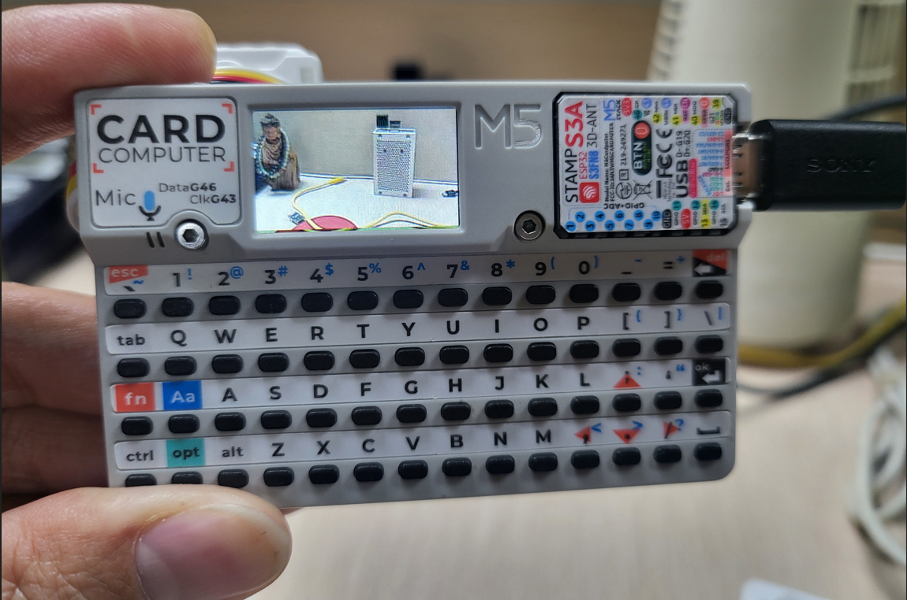
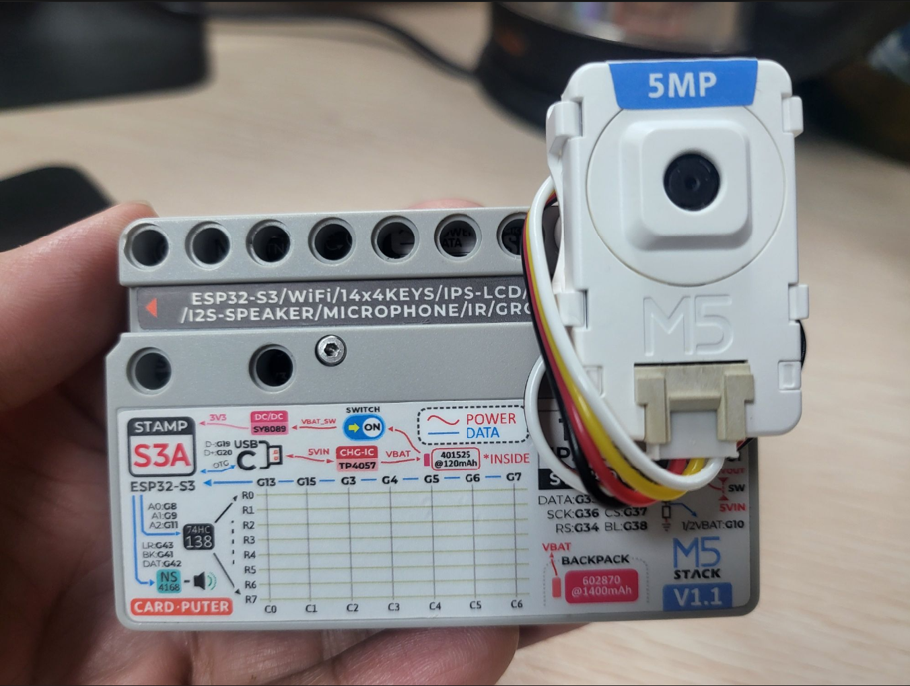

# M5Cardputer Camera Application
# M5Cardputer 相机应用

## Overview
## 项目概述

A simple camera application for M5Cardputer, developed with PlatformIO, that enables MJPEG streaming and image capture with SD card storage.

这是一个为M5Cardputer开发的简单相机应用，基于PlatformIO开发，支持MJPEG串流和带有SD卡存储功能的图像捕获。

## Features
## 功能特性

- **MJPEG Streaming**: Real-time camera feed display
- **Image Capture**: High-quality photo taking
- **SD Card Storage**: Save captured images to storage

- **MJPEG串流**：实时相机画面显示
- **图像捕获**：高质量照片拍摄
- **SD卡存储**：将捕获的图像保存到储存卡

## Hardware Requirements
## 硬件要求

- M5Cardputer
- M5 UnitCamS3-5MP camera module
- Micro SD Card
- USB-C cable

- M5Cardputer
- M5 UnitCamS3-5MP 摄像头模块
- Micro SD卡
- USB-C线缆
- 


## Software Requirements
## 软件要求

- PlatformIO
- ESP32 board support
- Required libraries (listed in platformio.ini)

- PlatformIO开发环境
- ESP32开发板支持
- 所需库文件（列于platformio.ini中）

## Usage
## 使用说明

1. Connect M5Cardputer to your computer
2. Build and upload the project using PlatformIO
3. Insert an SD card into M5Cardputer
4. Power on the device
5. The application will automatically connect to the camera module
6. View the live stream on the screen
7. Press BtnA to capture photos (saved to SD card)
8. Press 0-6 number keys to set special effect filter
9. Press ` (backtick) to view camera status and parameter settings
10. Adjust camera parameters using keyboard:

1. 将M5Cardputer连接到电脑
2. 使用PlatformIO构建并上传项目
3. 将Micro SD卡插入M5Cardputer
4. 打开设备电源
5. 应用将自动连接到相机模块
6. 在屏幕上查看实时串流画面
7. 按下BtnA按钮拍摄照片（保存到SD卡）
8. 按数字键0-6设置特效滤镜
9. 按`（反引号）查看相机状态和参数设置
10. 使用键盘调整相机参数：

### Camera Parameter Controls
### 相机参数控制

| Parameter | Key (Increase) | Key (Decrease) | Range |
| 参数 | 增加按键 | 减少按键 | 范围 |
|-----------|----------------|----------------|-------|
| Brightness 亮度 | `;` (semicolon) | `.` (period) | -2 to 2 |
| Contrast 对比度 | `/` (slash) | `,` (comma) | -2 to 2 |
| Saturation 饱和度 | `]` (right bracket) | `[` (left bracket) | -2 to 2 |
| Sharpness 锐度 | `=` (equals) | `_` (underscore) | -2 to 2 |
| Special Effect 特效 | `0-6` (number keys) | - | 0 to 6 |

## Configuration
## 配置选项

Resolution settings are defined at the top of `src/main.cpp`:

分辨率设置在`src/main.cpp`文件顶部定义：

```cpp
#define CAMERA_RESOLUTION_HIGH 13     // High resolution for photo capture
#define CAMERA_RESOLUTION_LOW 6       // Low resolution for streaming
```

```cpp
#define CAMERA_RESOLUTION_HIGH 13     // 用于拍摄照片的高分辨率
#define CAMERA_RESOLUTION_LOW 6       // 用于串流的低分辨率
```

## License
## 许可证

MIT