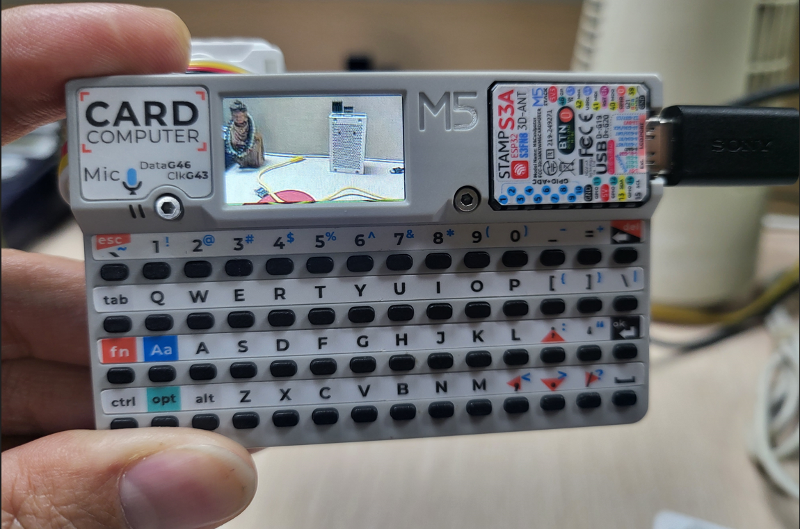
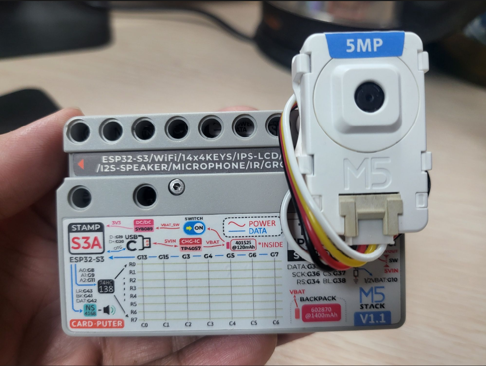

# M5Cardputer Camera Application
# M5Cardputer 相机应用

## Overview
## 项目概述

A simple camera application for M5Cardputer, developed with PlatformIO, that enables MJPEG streaming and image capture with SD card storage.

这是一个为M5Cardputer开发的简单相机应用，基于PlatformIO开发，支持MJPEG串流和带有SD卡存储功能的图像捕获。

## Features
## 功能特性

- **MJPEG Streaming**: Real-time camera feed display
- **Image Capture**: High-quality photo taking
- **WiFi File Transfer**: Access photos via browser over hotspot
- **Software Filters**: Creative effects like GameBoy, Glitch, etc.
- **SD Card Storage**: Save captured images to storage

- **MJPEG串流**：实时相机画面显示
- **图像捕获**：高质量照片拍摄
- **WiFi 文件传输**：通过热点在浏览器中直接下载照片
- **软件创意滤镜**：支持 GameBoy、像素、故障风等特效
- **SD卡存储**：将捕获的图像保存到储存卡

## Hardware Requirements
## 硬件要求

- M5Cardputer
- M5 UnitCamS3-5MP camera module
- Micro SD Card
- USB-C cable

- M5Cardputer
- M5 UnitCamS3-5MP 摄像头模块
- Micro SD卡
- USB-C线缆
- 


## Software Requirements
## 软件要求

- PlatformIO
- ESP32 board support
- Required libraries (listed in platformio.ini)

- PlatformIO开发环境
- ESP32开发板支持
- 所需库文件（列于platformio.ini中）

## Usage
## 使用说明

1. Connect M5Cardputer to your computer
2. Build and upload the project using PlatformIO
3. Insert an SD card into M5Cardputer
4. Power on the device
5. The application will automatically connect to the camera module
6. View the live stream on the screen
7. Capture photos (saved to SD card):
    - **Single Shot**: Short press `BtnA` to capture a high-resolution photo.
    - **Burst Mode**: Long press `BtnA` (> 0.5s) to capture high-resolution photos every 0.2s.
8. Press `0`-`6` number keys to set built-in camera special effect
9. Press `7`, `8`, or `9` to toggle Software Creative Filters (GameBoy, Pixelate, Glitch). Press the same key again to turn off.
10. Press `w` to enable **WiFi File Transfer Mode**. Connect to `Cardputer-Cam` and visit `http://192.168.4.1` on your phone to download images.
11. Press `` ` `` (backtick) to view camera status and parameter settings
12. Adjust camera parameters using keyboard:

1. 将M5Cardputer连接到电脑
2. 使用PlatformIO构建并上传项目
3. 将Micro SD卡插入M5Cardputer
4. 打开设备电源
5. 应用将自动连接到相机模块
6. 在屏幕上查看实时串流画面
7. 拍摄照片（保存到SD卡）：
    - **单张拍摄**：短按 `BtnA` 按钮。
    - **连拍模式**：长按 `BtnA` 按钮（>0.5秒），每0.2秒自动拍摄一张。
8. 按数字键 `0`-`6` 设置硬件内置特效
9. 按 `7`、`8` 或 `9` 切换软件创意滤镜（GameBoy风、像素风、故障风），同键再按即可关闭。
10. 按 `w` 键开启 **WiFi 无线传图模式**。连接 `Cardputer-Cam` 热点后，手机访问 `http://192.168.4.1` 即可预览下载照片。
11. 按 `` ` ``（反引号）查看相机状态和参数设置
12. 使用键盘调整相机参数：

### Camera Parameter Controls
### 相机参数控制

| Parameter | Key (Increase) | Key (Decrease) | Range |
| 参数 | 增加按键 | 减少按键 | 范围 |
|-----------|----------------|----------------|-------|
| Brightness 亮度 | `;` (semicolon) | `.` (period) | -2 to 2 |
| Contrast 对比度 | `/` (slash) | `,` (comma) | -2 to 2 |
| Saturation 饱和度 | `]` (right bracket) | `[` (left bracket) | -2 to 2 |
| Sharpness 锐度 | `=` (equals) | `_` (underscore) | -2 to 2 |
| Special Effect 内置特效 | `0-6` (number keys) | - | 0 to 6 |
| Creative Filter 创意滤镜 | `7`,`8`,`9` | - | Toggle (同键开关) |
| WiFi Transfer 传图模式 | `w` | - | Toggle (AP Mode) |

### Timelapse Mode
### 延时摄影模式

- Press `t` key to start timelapse mode
- Photos are automatically taken every 5 seconds
- Photos are saved to `/images/timelapse` directory
- Display shows photo count, countdown, remaining storage, and battery
- Screen turns off after 1 minute of inactivity (press any key to wake)
- Power off the device to exit timelapse mode and reset camera module

- 按`t`键启动延时摄影模式
- 每5秒自动拍摄一张照片
- 照片保存到`/images/timelapse`目录
- 屏幕显示照片数量、倒计时、剩余存储空间和电量
- 1分钟无操作后屏幕自动熄灭（按任意键唤醒）
- 关闭设备电源退出延时摄影模式并重置摄像头模块

## Configuration
## 配置选项

Resolution settings are defined at the top of `src/main.cpp`:

分辨率设置在`src/main.cpp`文件顶部定义：

```cpp
#define CAMERA_RESOLUTION_HIGH 13     // High resolution for photo capture
#define CAMERA_RESOLUTION_LOW 6       // Low resolution for streaming
```

```cpp
#define CAMERA_RESOLUTION_HIGH 13     // 用于拍摄照片的高分辨率
#define CAMERA_RESOLUTION_LOW 6       // 用于串流的低分辨率
```

## MJPEG Preview Optimization
## MJPEG 预览渲染优化

The application features a heavily optimized MJPEG streaming engine that achieves **7-10 FPS** (standard ESP32-S3 software decoding) with zero screen tearing.

本应用包含一个经过深度优化的 MJPEG 串流引擎，在标准 ESP32-S3 软件解码下可达到 **7-10 FPS** 的帧率，且完全消除了画面撕裂现象。

### Optimization Techniques
### 优化技术点

- **Buffered Batch Reading**: Implemented a 1024-byte local buffer for `WiFiClient` access, significantly reducing system call overhead.
- **Handshake Body Alignment**: Explicitly syncs to the `\r\n\r\n` header terminator before starting the chunked parser, preventing protocol drift (garbled screens) after reboots.
- **SOI/EOI Strong Alignment**: Aggressively scans for `0xFFD8` and `0xFFD9` markers to ensure only valid JPEG payloads reach the decoder.
- **15KB Circuit Breaker**: Discards any illegal frames exceeding 15KB to protect memory from stale stream data.
- **Self-Healing Reconnection**: Automatically restarts the MJPEG stream and resets the parser after 15 consecutive rendering failures.
- **Metric Caching**: Persists the last successful frame size in diagnostics to prevent "0 B" flicker.

- **带缓冲的批量读取**：为 `WiFiClient` 访问实现了 1024 字节的局部缓冲区，将系统调用次数减少了几个数量级，极大提升了吞吐量。
- **响应体强对齐 (\r\n\r\n Sync)**：在连接建立后强制检索 HTTP 响应头结束符，确保解析器从第一个真正的分块头开始解码，彻底消除了重启后的“花屏”现象。
- **SOI/EOI 强对齐**：解析器主动搜索 `0xFFD8` 开头和 `0xFFD9` 结尾，确保即使网络流包含杂质，解码器也只会收到合法的 JPEG 帧。
- **15KB 局帧熔断**：将单帧上限限制为 15KB，一旦由于流偏移检测到异常大包，立即熔断并复位解析器，清除过期数据堆积。
- **自愈式重连逻辑**：若连续 15 帧渲染失败，系统会自动重启 MJPEG 流连接并执行状态机全量重置，确保长时间运行的稳定性。
- **指标静态缓存**：缓存并显示上一帧有效图像的尺寸数据，解决了在统计时 Size 指标频繁跳 0 的误导性问题。


## License

## 许可证

MIT